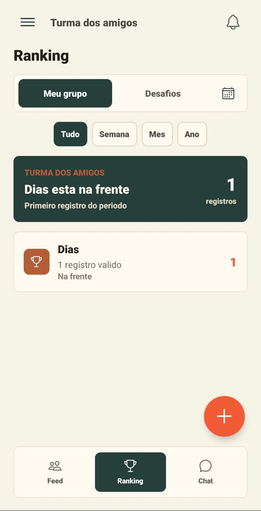
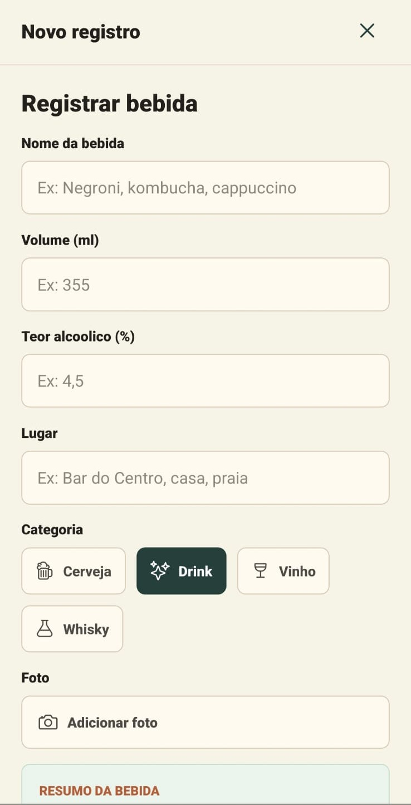
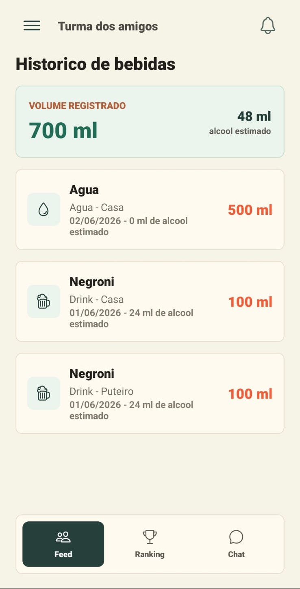
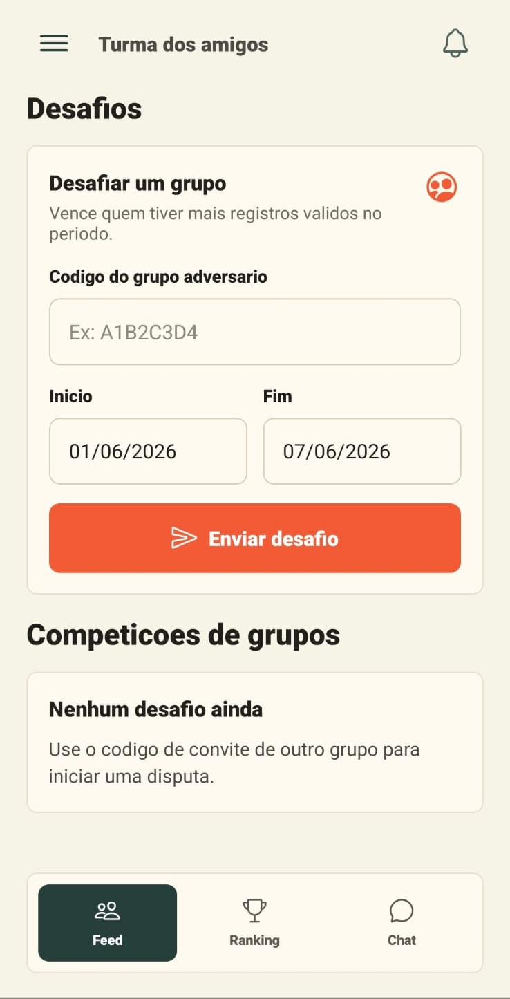

# Drink Rats

Aplicativo social mobile para registrar bebidas e compartilhar check-ins com
amigos. O projeto reúne grupos privados, feed, ranking e competições em uma
experiência voltada à interação entre pessoas próximas.

> Este repositório é uma apresentação pública do projeto. O código-fonte e a
> infraestrutura permanecem privados.

## Funcionalidades

- criação de conta e autenticação;
- grupos privados com convite por código;
- check-in de bebidas com categoria, volume, teor alcoólico, local e foto;
- feed do grupo com comentários e reações;
- ranking por período;
- histórico individual de registros;
- atualização de perfil e avatar;
- chat do grupo;
- competições entre grupos com placar e período configurável.

## Tecnologias utilizadas

- React Native
- Expo
- TypeScript
- Supabase Auth
- PostgreSQL
- Supabase Storage
- Supabase Realtime

## Galeria

| Ranking do grupo | Registro de bebida |
| --- | --- |
|  |  |

| Histórico individual | Competições entre grupos |
| --- | --- |
|  |  |

## Status

Projeto em desenvolvimento.
